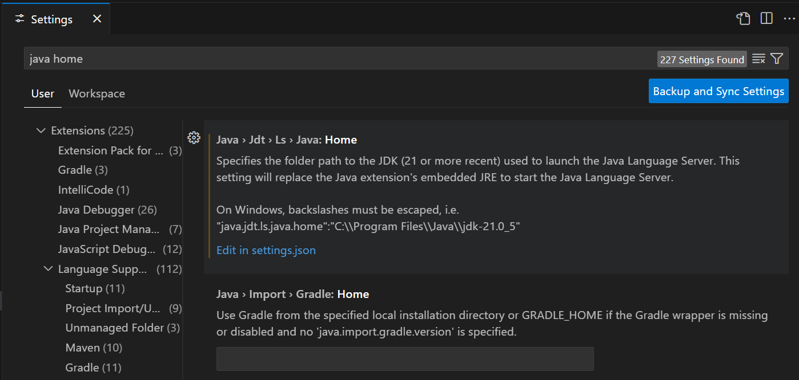
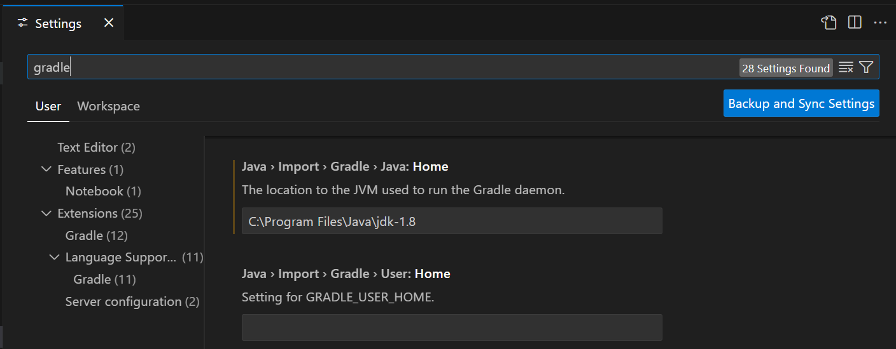

# struts_demo

## やりたいこと

- StrutsアプリケーションをTomcatで起動する。
- ビルドは組み込み`Gradle 6`を使用する。
- アプリケーションサーバは組み込み`Tomcat 7`を使用する。
- アプリ起動は`gradle-tomcat-plugin`を使用する。

## 前提環境

以下がインストール済みであること
- JDK 1.8
- git

> [!TIP]
> Java JDK 8 (Java SE Development 8) のインストール （Windows 上）  
> https://www.kkaneko.jp/tools/win/jdk8.html  

## Tree
```
├── build.gradle
├── gradlew
├── gradlew.bat
├─gradle
│  └─wrapper
│          gradle-wrapper.jar
│          gradle-wrapper.properties
│
├─lib
│      commons-beanutils.jar
│      commons-collections.jar
│      commons-digester.jar
│      commons-fileupload.jar
│      commons-lang.jar
│      commons-logging.jar
│      commons-validator.jar
│      jakarta-oro.jar
│      struts.jar
│
└─src
    └─main
        ├─java
        │  └─jp
        │      └─demo
        │          ├─action
        │          │      UserAction.java
        │          │
        │          └─actionform
        │                  UserForm.java
        │
        ├─resources
        │  └─resources
        │          application.properties
        │
        └─webapp
            │  index.jsp
            │  user.jsp
            │
            ├─pages
            │      Welcome.jsp
            │
            └─WEB-INF
                    struts-bean.tld
                    struts-config.xml
                    struts-html.tld
                    struts-logic.tld
                    struts-nested.tld
                    struts-template.tld
                    struts-tiles.tld
                    tiles-defs.xml
                    validation.xml
                    validator-rules.xml
                    web.xml
```

## 準備 githubからソースコードを取得

gitを使ってソースコードをダウンロードする
```
コマンドプロンプトで実行
git clone https://github.com/namickey/struts_demo.git
cd struts_demo
```

## tomcat起動 tomcatRun

起動する
```
コマンドプロンプトで実行
gradlew.bat tomcatRun
```

## ブラウザアクセス
http://localhost:8080/demo

## tomcat停止
```
Ctrl + C
```

## 開発環境 VSCode
以下を設定すれば、VSCodeでのビルドが成功する

VSCodeが使用するJDK21を設定する  


Gradleが使用するJDK1.8を設定する  


> [!TIP]
> VSCodeでJavaの開発環境を整える方法  
> https://pgcodetutor.com/vscode%E3%81%A7java%E3%81%AE%E9%96%8B%E7%99%BA%E7%92%B0%E5%A2%83%E3%82%92%E6%95%B4%E3%81%88%E3%82%8B%E6%96%B9%E6%B3%95/  
> 
> VSCode + SpringBoot(Gradle)でWebアプリの開発環境を構築する  
> https://qiita.com/gengen0719/items/bcdda4b8571f5e687051  
